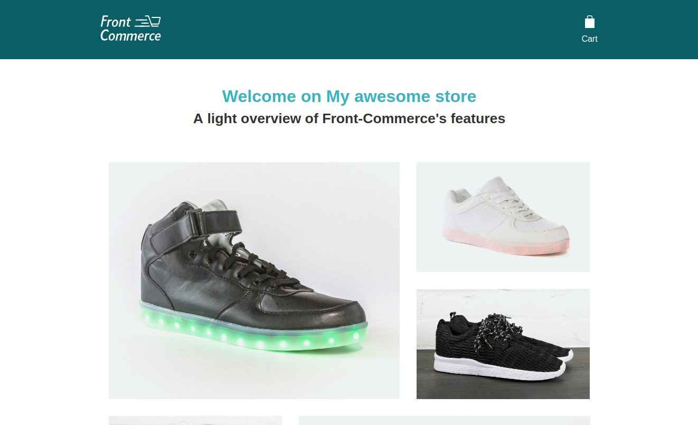

  <h1>Front-Commerce Lite</h1>

  

**Prototype your next eCommerce experiences using modern web technologies.**

Front-Commerce is a React application with a GraphQL middleware for building
eCommerce stores backed by existing headless platforms such as Magento2.
[Learn more about the product.](https://developers.front-commerce.com/)

  

  

  

## Overview

Front-Commerce Lite contains everything you need to get started in minutes with
the main libraries used in Front-Commerce. Consider it as a boilerplate for
prototyping an eCommerce application.

Here is what Front-Commerce Lite can help you with:

- start learning new technologies and concepts,
- experiment an idea with your team,
- evaluate Front-Commerce,
- convince your boss,
- or win projects by building a <abbr title="Proof of Concept">PoC</abbr>.

## Features

- **zero configuration:** start developing right away, all the tooling is
  already configured for you
- **great developer experience:** get in the flow with immediate feedback and
  interactive tools (<abbr title="Hot Module Reloading">HMR</abbr>,
  [GraphiQL](https://github.com/graphql/graphiql) and
  [Storybook](https://storybook.js.org/))
- **up-to-date libraries:** webpack, react, apollo, react-router… experiment
  with their latest features
- **microservices friendly:** understand the power of a GraphQL middleware for
  your microservices and start combining them in a creative way
- **component based:** browse our sample components to understand
  Front-Commerce’s implementation of
  [Atomic Design](http://atomicdesign.bradfrost.com/)
- **living design system:** discuss with your team and UX designers about how a
  Design System could improve your workflow, and test this process on a
  prototype built with Front-Commerce Lite

Front-Commerce Lite is an open source project designed after a more complete and
production ready product named
[Front-Commerce](https://developers.front-commerce.com/). It has been created
with development in mind and does not contain any tooling or practices for
production deployments. See the [What it is **NOT** section](#what-it-is-not)
for more details.

## Philosophy

We are on a mission to improve web quality and shopping experience on eCommerce
stores. Hence
[our vision](https://developers.front-commerce.com/docs/vision.html) is to sell
a product that contains all the best practices for building qualitative online
stores by default, so teams can stay focused on what is relevant to their
context.

One of the most frequent feedback we have from developers and teams when
introducing Front-Commerce is:

> Your product looks neat! Could we start playing with it, in order to (insert a
> totally valid reason here)?

We want you to understand the philosophy and the power of the technologies and
architecture principles we chose. **In our opinion code is the best way to do
it!**

However, learning from the whole Front-Commerce codebase might be a daunting
task for people not used to the JavaScript / React / GraphQL ecosystem. Since
our goal is to take care of this complexity, we thought it would be better to
create a simpler playground.

Front-Commerce Lite is a simpler version of what we have developed. It uses the
same libraries and follows the same principles and conventions. A direct
consequence is that our documentation works for both Front-Commerce and
Front-Commerce Lite.

We made [some opinionated choices](#what-it-is-not) in order to keep things
simple while allowing you to dig into the code and understand how everything
works under the hood.

Simple does not mean useless, and Front-Commerce Lite is aimed at helping teams
to « build stuff » and move forward. Use it to learn, understand, prototype or
sell Front-Commerce to your stakeholders!

## Get started

Start building something now!

### TL;DR

The following steps are all you need if you already are familiar with the
JavaScript ecosystem. Otherwise, jump to the next section.

1.  `git clone git@github.com:front-commerce/front-commerce-lite.git`
2.  `cd front-commerce-lite && npm install`
3.  `npm run dev:client` for the web application, and `npm run storybook` for
    Storybook
4.  open your favorite editor and start coding!

### Step by step

You may encounter difficulties to install or launch this project. You may also
want to understand step by step what is happening. It is totally fine, we are
here to learn! Time has come to discover our official documentation for
developers…

[Install Front-Commerce Lite (developers.front-commerce.com)](https://developers.front-commerce.com/docs/getting-started.html)

If you still have troubles with this task, feel free to
[get in touch with us](#get-help) and ask questions. It could be a problem on
our side too.

## Get help

Now that you have Front-Commerce Lite installed, you can play and experiment
with it. You can browse
[Front-Commerce’s developer documentation](https://developers.front-commerce.com/docs/)
to understand our implementation and architecture.

Here are some tasks you can try:

- [Adapt the theme to your brand](https://developers.front-commerce.com/docs/adapt-theme-to-brand.html)
- [Create or tweak a UI Component](https://developers.front-commerce.com/docs/create-a-ui-component.html)
- [Create a new Page](https://developers.front-commerce.com/docs/create-custom-page.html)
- [Extend the GraphQL schema](https://developers.front-commerce.com/docs/extend-graphql-schema.html)
- [Create a Business Component](https://developers.front-commerce.com/docs/create-a-business-component.html)

If you need help we encourage you to search on the web first. It will help you
discover the community around each project. You might find additional resources
for learning each library in-depth when you will be ready.

You can also open
[issues](https://github.com/front-commerce/front-commerce-lite/issues) with the
tag `« question »` and we will do our best to answer it. Of course, you can
[browse answered questions](https://github.com/front-commerce/front-commerce-lite/issues?q=label%3Aquestion+is%3Aclosed)
and try to help others by answering their opened questions.

We have
[a Slack channnel](https://join.slack.com/t/front-commerce/shared_invite/enQtMzI2OTEyMDYzOTkxLWY0Y2JjYmRmNGQ2MWM1NzQyMjQwNzlmYzJmYzgzNTIwYzQ3MDVkMWZiYmYwNWFhODhmYWM5OTI4YjdiZDJkY2Q)
that you can join to ask for help and if you need anything else,
[send us an email!](mailto:contact@front-commerce.com)

## What it is **NOT**

The _« Lite »_ keyword in the project name has its importance. Our vision is to
help you understand what you could achieve with such a tool, without introducing
unnecessary complexity. The path to a successful and production ready store is
long and that is why we have built
[Front-Commerce](https://www.front-commerce.com) in the first place.

Front-Commerce is not an open source product and we cannot share all the code
behind it. Thus, we had to make opinionated choices about what _not_ to include
in Front-Commerce Lite.

Here are the features we do not plan to add in Front-Commerce Lite:

- **<abbr title="Server Side Rendering">SSR</abbr>:** with SSR comes some
  constraints and complexity we not consider necessary for this project. We
  prefer keeping the implementation simple and straightforward to allow you to
  analyze how everything works internally. If you want to see SSR in action,
  please refer to
  [Front-Commerce’s public demo](https://demo.front-commerce.com/).
- **complete eCommerce pages:** we will try to keep the number of pages and
  components as minimal as possible to make it easier to see the whole picture.
  Our goal is to showcase possible use cases. In a real project, you will have
  more pages (account, forgotten password, contact page…) to manage
- **optimized production builds:** the tooling is for a development context
  only. If you want to create a production config, you will have to do it and
  maintain it yourself (it is a great way to learn)
- **deployment recipes:** if you want to share your project with the world, you
  will have to create your own deployments for your hosting provider of choice
- **performance optimization:** GraphQL resolvers in Front-Commerce use the
  [DataLoader pattern](https://github.com/facebook/dataloader) with caching to
  improve performance with slow backends. We do not want to introduce this
  complexity here.
- **refactorings or library upgrades** that do not match what is available in
  Front-Commerce: **we do not want to lie to you about Front-Commerce’s state**,
  and want Front-Commerce Lite to match what you will find in Front-Commerce. We
  want to update Front-Commerce Lite only when the code is merged in
  Front-Commerce. Refactorings could be trivial here but not as straightforward
  there…
- **backwards compatibility:** Front-Commerce Lite should be used for learning
  or prototyping. We do not recommend to build a long living project with
  it! Things may be broken.
- **middleware or backoffice access:** we do not want to maintain complex
  backend systems for allowing developers to customize data. If you want to use
  your own catalog, you will have to be creative and adapt the core. **We can
  create dedicated demo instances for partners or serious potential customers**.
  If you would like to go further with your prototype and are interested by
  Front-Commerce, [send us an email](mailto:contact@front-commerce.com) and we
  will see how we could help.

## Going in production

Convinced that Front-Commerce Lite’s stack is viable enough for your project? If
yes, **we achieved our goal!**

You now have several solutions:

- start a project from scratch using these technologies. If your needs are
  simple it could be a solution, otherwise prepare yourself to months of work!
- compare with existing alternatives and choose the one which fits your needs
  and budget: features, architecture, test coverage and (if they are open
  source) the quality of their codebase
- fork Front-Commerce Lite in the open, follow our philosophy and architecture…
  and name it React Storefront :)
- use [Front-Commerce](https://www.front-commerce.com/) and start developing
  your features on top of a production ready solution **right now!**

:email:
[Contact our team to get further information and contract a Front-Commerce license.](mailto:contact@front-commerce.com)

## License

MIT
